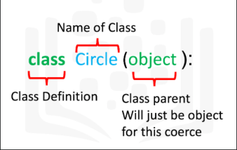
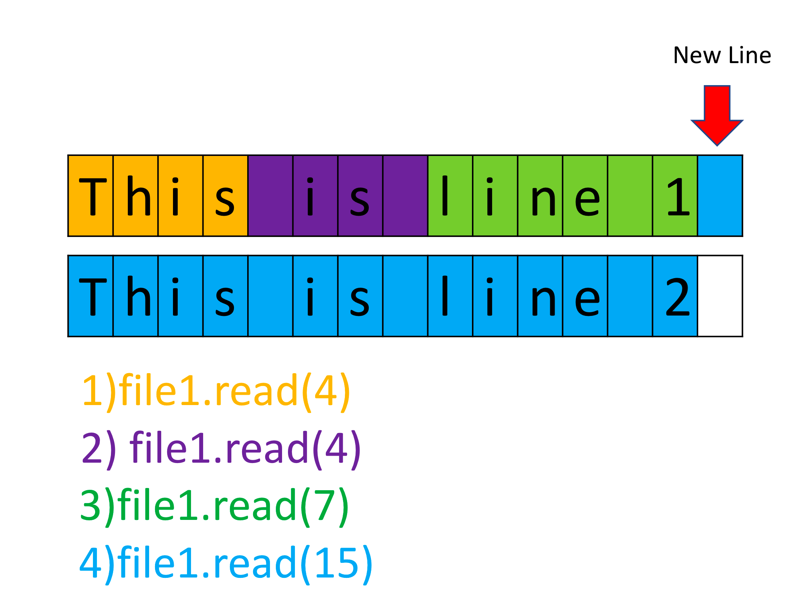
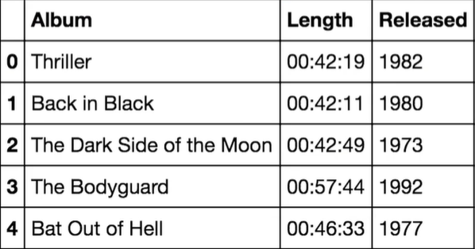
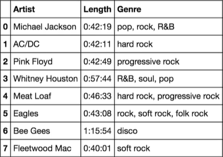
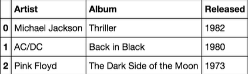
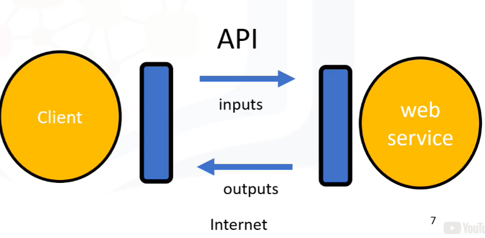

## About the course

- 3h to complete, started Sunday, 20/12/2020

> Jupyter Notebooks are a popular data science tool that lets Data Scientists write code, see the results, and describe what's happening -- all in a single document.

## Types in Python

- You can use `type()` function to receive the data type of parameter

```python
type(11) # int
type(21.213) # float
type("Hello Python") # str
```

- Typecasting

```python
float(2) # 2.0
int(1.1) # 1
int('1') # 1
int('A') # error

str(1) # "1"
str(4.5) # '4.5'

int(True) # 1
int(False) # 0

bool(1) # True
bool(0) # False
```

- In Python, if you cast a float to an integer, the conversion truncates towards zero.
- Boolean: True and False (with capital letter)
- If you cast a boolean True to integer, you will get 1
- Do casting functions return the type or print on screen?
- Differences between syntactic vs semantic error

## Expressions and Variables

Operands (numbers) operators (math signals)

`+ - / * //`

- Double slash (`//`) for integer division, where the result is rounded

```python
my_variable = 10
```

## String Operations

- In Python a string is a sequence of characters contained within two or single quotes
- Think of a string as an ordered sequence. Each element in the sequence can be accessed using an index represented by the array of numbers

```python
name = "Michael Jackson"
name[0] # M
name[6] # l
name[-1] # n
name[-15] # M
```

- You can also use negative indexing with strings
- The first last element is given by the index -1, and so on

```python
name[::2] # "McalJcsn"; select every second variable
name[0:5:2] # "Mca"; select second variable from 0 to 5
name[0:5] # Micha; 0 to 4 (excludes 5)
```

```python
len("Michael Jackson") # 15
statement = name + " is the best" # concatenation
```

```python
3 * "Michael Jackson " # replicating string
```

- **Strings are immutable**: you cannot change its value, but you can create a new string (and set it to the original variable)

```python
name[0] = "J" # Error
```

### Scape sequences

- `\n` represents a new line
- `\t` gives a tab 
- If you want to place a backlash in your string, use a double backslash (and the result will be just one).

### String methods

- When we apply a method to the string "A" we get a new string "B" that is different from "A"

```python
B = A.upper()
B = A.replace('Michael', 'Janet') - replaces a segment of the string
name.find('el') # 5
# if the substring is not in the string, the output is negative one (-1)
```

| Syntax                                    | What it does                                                 |
| ----------------------------------------- | ------------------------------------------------------------ |
| `str2 = str1.upper()`                     | Set all characters to uppercase                              |
| `str2 = str1.replace('Michael', 'Janet')` | Replaces a segment of the string (first argument) with the second argument |
| `str.find('el')`                          | Returns the start position of substring                      |

```python
Letters="ABCDEFGHIJK"
Letters[0:4] # ABCD, 0-3 (indexes)

Good="GsoAo+d"
Good[::2]
```

---

> Module 2 - Python Data Structures

## Tuples

- Compound data type
- Tuples are an ordered sequence
- Tuples are written as comma-separated elements within parentheses

```python
Ratings = (10, 9, 6, 5, 10, 8, 9, 6, 2)
tuple1 = ('bom dia', 10, 1.5, True)

type(tuple1) # tuple
```

- Several types can be contained in a tuple, but the type of the variable is "tuple"
- Indexes are used to access each element
  - -1 is the last element, and -2 penultimate, etc.
- **Concatenating tuples**

```python
tuple2 = tuple1 + ("boa tarde", 10)
# ("bom dia", 10, 1.5, True, "boa tarde", 10)
```

- **Tuple slicing**
  - the last index is one larger than the index you want
  - but the first enters the selected slice

```python
tuple2[0:3] # ('bom dia', 10, 1.5)
tuple2[3:6] # (True, 'boa tarde', 10)
```

- Length of a tuple: `len()`

```python
len(("bom dia", 10, 1.5, True, "boa tarde", 10)) # 6
```

- **Tuples are immutable** and if we would like to manipulate one we must create a new tuple instead.
- Two variables can reference the same tuple object

```python
tuple1 = tuple2 # there is only one tuple, no copy
tuple2[0] = "New element!"; # error!

tupleSorted = sorted(tuple); # creates a new tuple
```

- **Nesting**: a tuple can contain other tuples as well as other complex data types
  - Add more square brackets to access deep tuples elements or string characters, for example.

```python
bigTuple = (1, 2.5, ('hi', (5,4)), (10, 21.2))

bigTuple[0] # 1
bigTuple[2] # ('hi', (5,4)) 
bigTuple[2][0] # 'hi'
bigTuple[2][0][1] # 'i'
```

## Lists

- Are also ordered sequences
- A List is represented with square brackets `[]`
- **Lists are mutable**

```python
list1 = ['Michael Jackson', 10.1, 1982, [1,2], ('A', 1)]
```

- Index works same as tuples, including negative numbers, slicing and concatenating.

```python
list1.extend(['pop', 10]) # this method adds these list elements to the list1 (concatenation)
# the original list is modified!

# it is also concatenation:
list1 = list1 + list2
```

- Adding a new element, modifying elements, deleting

```python
list1.append(new element) # adds to list end (creating the next index)
list1[0] = "hard rock"
del(list1[0]) # replaces indexex
```

- Split a string in elements of a list

```python
"hard rock".split(",") # default separator is space
```

- Lists are objects
  - If a and b references the same list (aliasing), changes occur to both variables
  - `b = a[:]` clone a list (so there will be two objects and changes won't occur simultaneously)
- `print(list1)` - prints all elements (you don't need a `foreach`) - also works with tuples

```python
B=["a","b","c"]
B[0] = B[0].upper()
print(B)
```

```python
C_tuple=(-5, 1, -3)
sortedList = list(C_tuple)
print(sorted(sortedList)) # [-5, -3, 1]
```

> `help()` function can be useful. help(list1)
>
> tuple1.index("disco")
>
> list1.reverse()

## Sets

- Sets are a type of collection
  - This means that like lists and tuples you can input different Python types
- Unlike lists and tuples they are unordered
  - This means sets do not record element position
- Sets only have unique elements
- To define a set you use curly brackets

```python
set1 = {10, "oi", True, "oi"}

set1 = set(list1) # removes duplicates
```

- Set Operations

  - Add
    - `A.add(new item)`
  - Remove
    - `A.remove(item)`
  - In
    - `"oi" in A`
    - Returns True or False

- Mathematical set operations

  - Intersection (&)
    - All the items that are not in both sets disappear
    - `set3 = set1 & set2`
    - `set1.intersection(set2)`
  - Union
    - The result is a new set that has all the elements of set1 and set2 (and not just the overlap)
    - But of course it will discard duplicate values
    - `set3 = set1.union(set2)`
  - Is subset
    - Checking if a set is a subset (if it is contained in another)
    - `set2.issubset(set1)` # True/False
    - if all elements of set2 are in set1
  - Is superset
    - `set1.issuperset(set2)`
  - Difference
    - `set1.difference(set2)`
      - all elements that are only contained in set1
      - excludes set2 and set1 & set2

  > can I use `in` to tuples and lists?

```python
A = [1, 2, 2, 1]
B = set([1, 2, 2, 1])
C = (1, 2, 2, 1)

sum(A) == sum(B)
sum(B) == sum(C)
sum(A) == sum(C)
```

## Dictionaries

- Collection that have keys in place of numerical indexes.
  - **Keys can only be strings, numbers or tuples, but values can be any data type**
- To create a dictionary you use curly brackets `{ }`
- Each key is separated from its value by a colon `:`. Commas separate the items

```python
Dict = {"key1": 1, "key2": "2", "key3": [3, 3, 3], "key4": (4, 4, 4), ('key5'): 5, (0, 1): 6}

Dict[('key5')] # 5
```

- **For every key, there can only be one single value, however, multiple keys can hold the same value**
- Retrieving the keys of the dictionary
  - `dict.keys()`
- Retrieving values
  - `dict.values()`
- Adding an entry
  - `dict['new key!'] = 1000`
- Deleting an entry
  - `del(dict['key1'])`
- Verifying if an element is in the dictionary (by its key)
  - `'key1' in dict` # True/False

---

> Module 3 - Python Programming Fundamentals

## Conditions and Branching

==, !=, >, <, >=, <=

"Oi" == "Olá"

- Branching allows us to run different statements for a different input.

```python
age = 19
if (age > 18):
	print("You can enter")
elif (age == 18):
	print('Come on next year!')
else:
    print("You are too young")
print("move on")
```

- Logic operations take boolean values and produce different boolean values

```python
not(True) # False

not(False) # True

or, and, not
```

- Indent delimits code blocks

```python
if (album_year < 1980) or (album_year > 1989):
	print("The album was made in the 70's or 90's")
elif (album_year >= 1980) and (album_year <= 1989):
    print("The album was made in the 80's")
    
    
if not (album_year == '1984')
	print("Album year is not 1984")
```

- Compare characters (ASCII)
  - 'B' > 'A' # True
  - When there are multiple letters, the first letter takes precedence in ordering
  - Upper case letters have different ASCII code

## Loops

- For and while loops

```python
range(3) # [0,1,2]
range(10,15) # [10,11,12,13,14]
```

```python
for i in range(0,5):	# foreach
	squares[i] = 'white'
    
for square in squares:
    square = 'white'
    
for i, square in enumerate(squares):
	print(i, square)
```

```python
while (squares[i] != 'orange'):
	i = i + 1 # i++ does not exist here
```

```python
dates = [1982,1980,1973]
N = len(dates)

for i in range(N):
    print(dates[i])
    
squares = ['oi', 'orange', 'orange', 'purple', 'blue ', 'orange']
new_squares = []
i = 0
while squares[i] is not 'orange':
    new_squares.append(squares[i])
    i += 1
print (new_squares)
```

## Functions

- Functions take some input then produce some output or change
- It's just a piece of code you can reuse

### Python built-in functions

- You do not have to know how they work!

#### Len

- Returns the length of a sequence of collection

#### Sum

- Adds all the elements in a list or tuple
  - what about other collections?

#### Sorted vs Sort

- The function `sorted()` returns **a new** sorted list or tuple
- But method `sort()` changes the input collection

```python
sorted_list1 = sorted(list1);
list2.sort();
```

### Making functions

```python
def add1(a):
    """
    add 1 to a
    """
	b = a + 1
	return b

c = add1(5) # 6
```

- Documentation: triple quotes. Shows this string if you use `help(add1)`
- If you accidentally multiply an integer and a String instead of two integers, you won't get an error (remember that multiplication symbol can also mean repeat a sequence)
- Return statement is not mandatory and Python will return none object by default
- Python doesn't allow a function to have an empty body, so we can use the keyword `pass`
- **The statement `return` always exits a function.**

```python
def NoWork():
	pass
	return None # this line is optional

print(NoWork()) # None
```

- **Variadic parameters**
  - Allow us to input a variable number of elements

```python
def ArtistNames(*names):
	for name in names:
		print(name)
        
ArtistNames("Michael Jacson", "AC/DC")
```

- **Default argument values**

```python
def isGoodRating(rating=4):
    if (rating < 7):
        print("This album sucks")
    else:
        print("This album is good")
```

### Scope

- The part of the program where the variable is accessible.
- Variables that are defined outside of any function are said to be within the global scope, meaning they can be accessed anywhere after they are defined
- A variable that is declared inside a function is called a local variable
- If a variable is not defined within a function, Python will check the global scope and uses its value
- You use the word `global` to let variable be used outside the function scope.

```python
def AValue():
	global value
    value = '45 million'
	return value

AValue()
print (value) # '45 million'
```

```python
def con(a, b):
    return(a + b)

tuple1 = (1, 'a', (2, 2))
tuple2 = con(tuple1, ('x', 1)) # you can only concatenate tuple to tuple
print(tuple2)
```

## Objects and Classes

- The class has data attributes and also has methods

```python
class Circle(object):
    def _init_(self, radius = 3, color = 'blue'): # class constructor
        self.radius = radius
        self.color = color
        
    def add_radius(self, r):
        self.radius += r
    
class Rectangle(object):
    def _init_(self, color, height, width):
        self.color = color;
        self.height = height; # I don't know about semi-colons, they're probably optional
        self.width = width
        
C1 = Circle(10, "red")
C1.radius = 15
C1.add_radius(8)

BlueCircle = Circle(radius=100)
```



- We do not need to worry about the self-parameter when calling the method
- the `dir` function is useful for obtaining the list of data attributes and methods associated with the class
  - `dir(Nameofobject)`

> this part is optional
>
> ```python
> # Import the library
> 
> import matplotlib.pyplot as plt
> %matplotlib inline 
> 
> # ...
> 
> def drawCircle(self):
>     plt.gca().add_patch(plt.Circle((0, 0), radius=self.radius, fc=self.color))
>     plt.axis('scaled')
>     plt.show() 
> ```

```python
A=['1','2','3']

for a in A:
	print(2*a) # 11 22 33
```

---

> Module 4 - Working with Data in Python

## Reading files with open

```python
File1 = open("/resources/data/Example2.txt", "w")

# the last parameter is mode: 'a' for appending, 'r' for reading, 'w' for writing

File1.name # '/resources/data/Example2.txt'

File1.mode # 'r'

File1.close() # we must close the file object!
```

- Using a 'with' statement to open the file **is better practice** because it automatically closes the file.
  - The code will run everything in the indent block, then closes the file.
- file1 is a variable that points to file object

```python
with open('Example1.txt', 'r') as file1:
    file_stuff = file1.read()
    print(file_stuff)

print(file1.closed) # says if it is closed
print(file_stuff)
```

```python
# Read certain amount of characters
!wget -O /resources/data/Example1.txt https://s3-api.us-geo.objectstorage.softlayer.net/cf-courses-data/CognitiveClass/PY0101EN/labs/example1.txt
    
example1 = "/resources/data/Example1.txt"

with open(example1, "r") as file1:
    print(file1.read(4)) # This
    print(file1.read(4)) #  is  
    print(file1.read(7)) # line 1
    print(file1.read(15)) # This is line 2
```

- We can output every line as an element **in a list** using the method `readlines()`
  - The first line corresponds to the first element in the list
  - The second line to the second element, and so on

```python
with open (example1, 'r') as file1:
	FileAsList = file1.readlines()
	# read all lines and save as a list
    
FileAsList[0]
FileAsList[1]
FileAsList[2] # third line
```

- The `open` function provides a File object that contains the methods and attributes you need in order to read, save and manipulate the file
- `readline()` to read the first line of the file



```python
with open(example1, "r") as file1:
    print("first line: " + file1.readline())
```

```python
with open(example1, 'r') as file1:
    i = 0;
    for line in file1:
        print('Iteration', str(i), ': ', line)
        i = i + 1;
```

## Writing files with open

- The method `.write()` works similar to the method `.readline()`, except instead of reading a new line it writes a new line.

```python
with open ('/resources/data/Example2.txt', 'w') as writefile:
    writefile.write("This is line A\n")
    writefile.write("This is line B\n")
    
# Using 'w' parameter: creates a file Example2.txt in your directory 
# if you have that file in your directory, it will be overwritten
```

```python
# You can verify modifications by reading the file and printing out the values

with open('/resources/data/Example2.txt', 'r') as testwritefile:
    print(testwritefile.read())
```

- By setting the mode argument to **a** you can append a new line as follows:

```python
with open('/resources/data/Example2.txt', 'a') as writenewlinefile:
	writenewlinefile.write("This is line C\n")
```

```python
Lines = ['This is line A\n', 'This is line B\n', 'This is line C\n']
with open('Example2.txt', 'w') as writefile:
    for line in Lines:
        writefile.write(line)
```

```python
with open('Example2.txt', 'r') as readfile:
    with open('Example3.txt', 'w') as writefile:
        for line in readfile:
            writefile.write(line)
```

## Loading data with pandas

- Dependencies = libraries: pre-written code to help solve problems
- Pandas is a popular library for data analysis
- It assumes that panda was installed by pip

`import pandas as pd `

### `pd.read_cvc(cvc_path)`

- Stores data in a variable (data frame - comprised of rows and columns)
- Also: `pd.read_excel(xlsx_path)`

```python
import pandas
path = 'file1.csv'

df = pandas.read_cvc(path)
```

### `df.head()`

- Shows the first 5 rows of a data frame
- Or pass a number by parameter to specify how many rows you want

### `pd.DataFrame(dict)`

- Creating a data frame out of a dictionary
- The keys correspond to the column labels (table headers). The values are lists corresponding to the rows

```python
songs = {'Album' : ['Thriller', 'Back in Black', 'The Dark Side of the Moon', 'The Bodyguard', 'Bat Out of Hell'],
        'Released': [1982, 1980, 1973, 1992, 1977],
        'Length': ['00:42:19', '00:42:11', '00:42:49', '00:57:44', '00:46:33']}

songs_frame = pd.DataFrame(songs)
```



### `df['a']`

- Obtain column 'a' as a series. Just use one bracket

```python
x = df['Length']
```

### `x = df[[col]]`

- Creates a new dataframe
- We just put the dataframe name and the name of the column(s) header enclosed in double brackets
  - The result is **a new dataframe** comprised of the specified column(s)

```python
x = df[['Artist', 'Length', 'Genre']]
```



### `df.iloc[row-index, column-index]`

### `df.loc[row-index, 'column-label']`

```python
df.loc[0, 'Artist'] # Michael Jackson
df.iloc[1, 0] # AC/DC
```

- You can slice dataframes and assign values to a new dataframe as well

```python
z = df.iloc[0:2, 0:2]
z = df.loc[0:2, 'Artist':'Released']
```



try `df.iloc[:, integer]`

`.ix` is deprecated

By the way, `df.loc[:,'col_header']` is for str or Boolean indexing

> Please use .loc for label based indexing or .iloc for positional indexing

## Working with and Saving data with Pandas

- Pandas has the method unique to determine the unique elements in a column of a dataframe
  - It removes duplicates

```python
df['column-name'].unique() # creates a list? another df?

df['column-name'] >= 1980 # true/false values

df1 = df[df['Released'] >= 1980]
	# a new dataframe where each album was released after 1979
    # returns all columns!
```

### Save as CSV

```python
dif1.to_csv('new_songs.csv') # saves a dataframe to csv file
```

- Remember to use `.csv`
- There are other functions to save the dataframe in other formats

## Simple APIs - Part 1

- Application Program Interfaces
- API Libraries
- REST API (**RE**presentational **S**tate **T**ransfer)
  - Request = input and Response = output
  - A type of API that allow to communicate through the internet
    - storage, access more data, AI algorithms and much more
  - Your program is the client



- Like a function, you do not have to know how the API works, but just the inputs and outputs.
- It allows comunication between your program and other software component

`id_warriors = df_warriors[['id']].values[0][0]`

- API key: way to access the api. Unique set of characters that API uses identify and authorize you. It's usually in the first API call
  - Keep it secret!
- An endpoint is simply the location of the service. It's used to find the API on the internet, just like a web address.

```python
!pip install ibm_watson get

from ibm_watson import SpeechToTextV1
import json
from ibm_cloud_sdk_core.authenticators import IAMAuthenticator

url_s2tOtavio = "https://api.us-south.speech-to-text.watson.cloud.ibm.com/instances/*******" # sevice endpoint

iam_apikey_s2t = "***********" # API key

auth = IAMAuthenticator(iam_apikey_s2t) # receives something (?)
s2t = SpeechToTextV1(authenticator=auth)
s2t.set_service_url(url_s2tOtavio)

filename = 'PolynomialRegressionandPipelines.mp3'

with open(filename, mode='rb') as wav: # file object wav. rb is readmode but in binary
    response = s2t.recognize(audio=wav, content_type='audio/mp3')
    	# method regonize to return the recognized text. 
        # Parameter audio: file object wav
        # Parameter content_type: format of the audio file
        
response.result # this attribute contains a dictionary that includes the translation

```

```python
from ibm_watson import LanguageTranslatorV3

url_lt = 'https://...'
apikey_lt = '***'
version_lt = '2018-05-01'


auth = IAMAuthenticator(apikey_lt)
language_translator = LanguageTranslatorV3(version = version_lt, authenticator = auth)
language_translator.set_service_url(url_lt) # Language translator object

```

```python
from pandas.io.json import json_normalize
json_normalize(language_translator.list_identifiable_languages().get_result(), 'languages')

translation_response = language_translator.translate(text = recognized_text, model_id = 'en-es')

translation = translation_response.get_result() # a dictionary
spanish_translation = translation['translations'][0]['translation'] # obtain as a string

# translate back to English

english_translation = language_translator.translate(text = spanish_translation, model_id = 'es-en').get_result()
```

